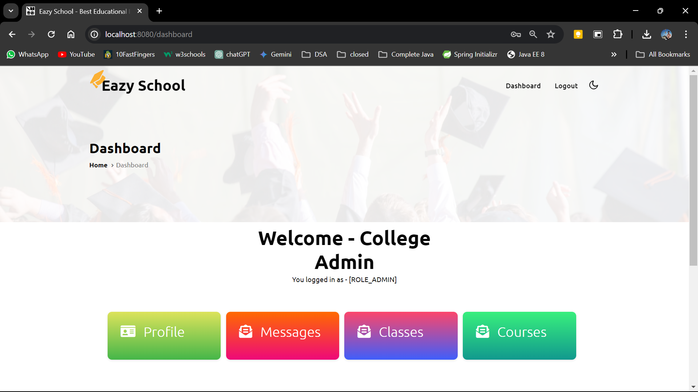

# Eazy School Management System

Live experience: [Check here](https://eazyschool-nh9f.onrender.com).

### Light Mode

### Dark Mode


## Overview
Eazy School is a robust online school platform built using Spring Boot, leveraging a modern tech stack to deliver a seamless learning experience. 
The platform caters to both `students` and `administrators`, providing comprehensive features for course management, enrollment, communication, and more.

This system is built by using Spring Boot, Hibernate, MySQL, Thymeleaf, and various other technologies. It serves as both an `MVC` application and a `RESTful API`.


## Key Features

- **Dual Functionality:** Operates as both a Model-View-Controller (MVC) web application and a RESTful API service, catering to various use cases and integration scenarios.
- **Role-Based Access Control:** Implements Spring Security with two distinct roles (student, admin) to ensure appropriate access to features and data.
- **Spring Boot**: Utilized for rapid application development.
- **Hibernate**: Object-relational mapping for database interaction.
- **MySQL**: Relational database management system for data storage.
- **Thymeleaf**: Frontend templating engine for dynamic web page generation.
- **Spring Security**: Ensures secure authentication and authorization with roles for students and admins.
- **RESTful APIs**: Provides a comprehensive RESTful API with Hypermedia as the Engine of Application State (HATEOAS) for navigation and discoverability (HAL Explorer integration).
- **HAL Explorer**: Tool for navigating and testing REST APIs.
- **Actuators**: Exposes endpoints for monitoring and management purposes.
- **Spring Data JPA**: Simplifies data access with JPA.
- **Spring Data REST**: Easily expose repositories as RESTful endpoints.
- **Lombok**: Reduces boilerplate code with annotations.
- **Aspect (AOP)**: Used for cross-cutting concerns like logging and performance monitoring.
- **Validations**: Ensures data integrity and consistency.
- **Integrated MVC and RESTful**: Seamlessly combines MVC architecture with RESTful principles.
- **Testing:**  Thorough testing of RESTful services using Postman ensures reliability and adherence to specifications.


## Screenshots

- ### Login Page


- ### Student Dashboard


- ### Admin Dashboard


- ### HAL Explorer


- ### Courses


## Technical Stack

* **Core Framework:** Spring Boot
* **ORM:** Hibernate (with Spring Data JPA)
* **Database:** MySQL
* **Frontend:** Thymeleaf
* **API Design:** RESTful API with HATEOAS (HAL)
* **Testing Tools:** Postman
* **Build Tool:** Maven
* **Security:** Spring Security
* **IDE:** Intellij IDEA
* **Other:** Lombok, Spring Data REST, Spring Boot Actuator, AspectJ


## Getting Started
1. **Prerequisites:**
    * Java JDK 8+
    * MySQL server
    * Maven

2. **Clone the repository**:
   ```bash
   git clone https://github.com/your-username/school-management-system.git
   ```

3. **Configure MySQL**:
    - Create a MySQL database named `eazyschool`.
    - Run database scripts.
    - Update `application.properties` with your MySQL username and password.

4. **Run the application**:
   ```bash
   mvn spring-boot:run
   ```

5. **Access the application**:
   Open your web browser and go to `http://localhost:8080`.
6. To access admin page use `admin@eazyschool.com` as username and `Admin@123` as password.


## Usage

- Students can log in to view their courses, classes, and also able to enroll new classes or courses.
- Admins can manage courses, students, requested contacts and other administrative tasks.

## License

This project is licensed under the [MIT License](LICENSE).

## Contact

For any inquiries or support, please contact [pranavpisal2528@gmail.com](mailto:pranavpisal2528@gmail.com).
